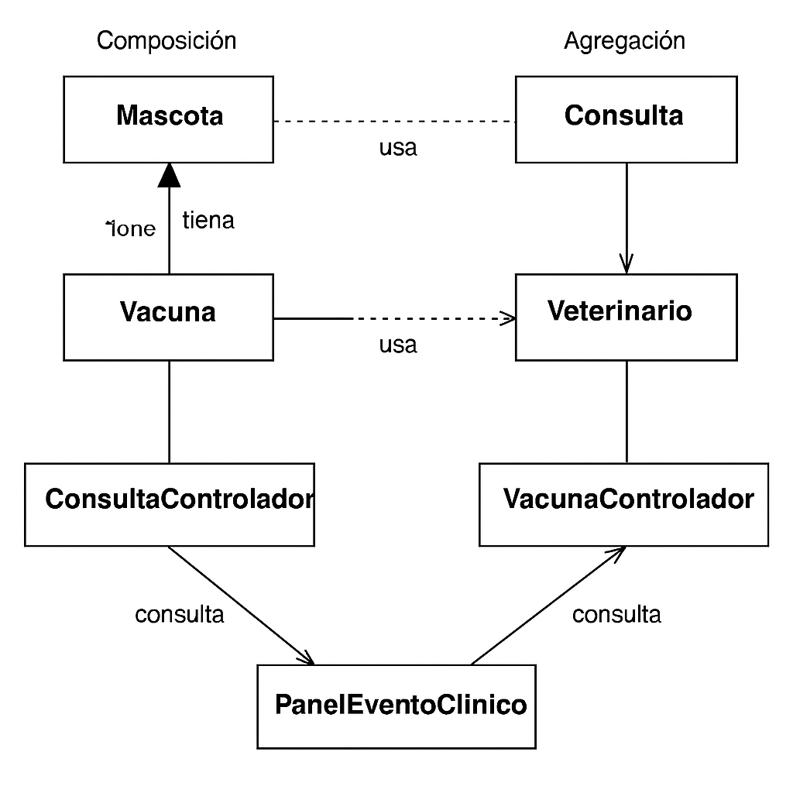
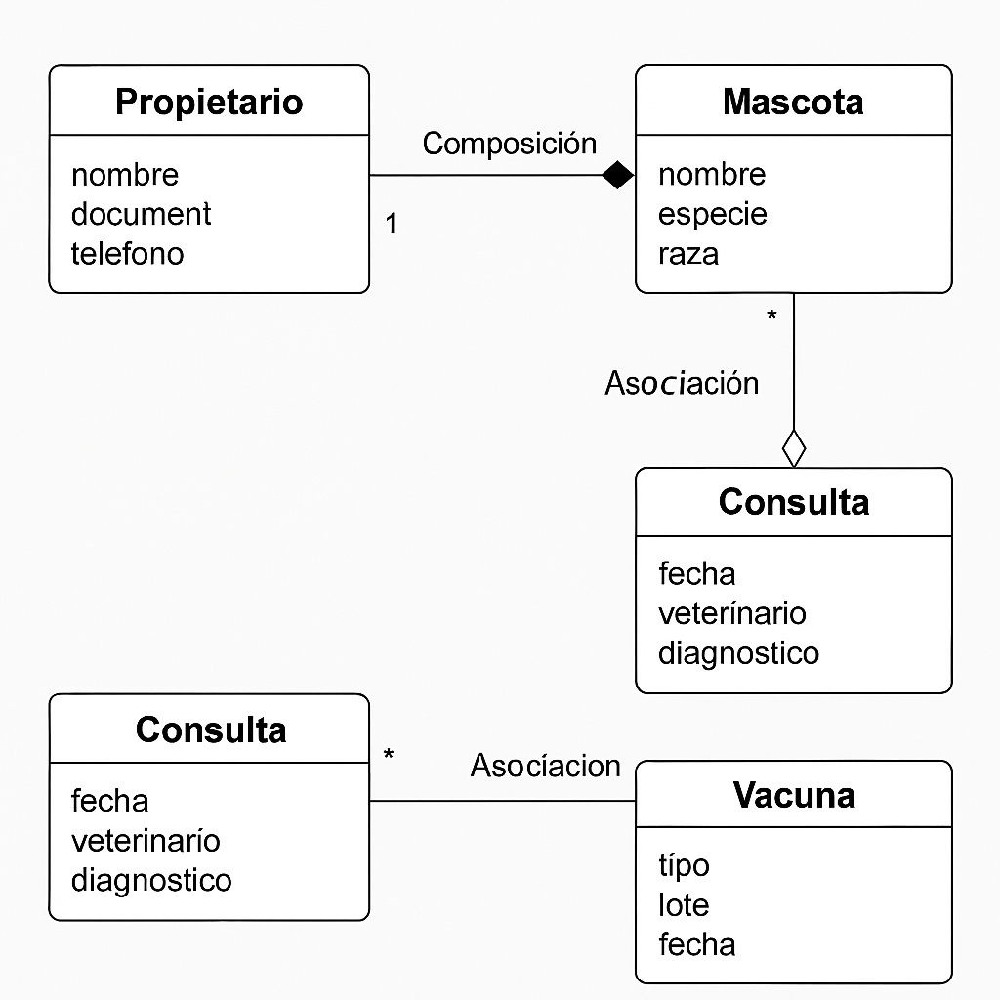

🐶 Sistema de Gestión Clínica Veterinaria
Versión: 1.2
Desarrollado por: Juan Guillermo Salazar
© 2025 – Todos los derechos reservados

Este proyecto implementa un Sistema de Gestión Clínica Veterinaria en Java, con interfaz gráfica Swing y persistencia en archivos, permitiendo la administración de mascotas, propietarios, veterinarios, consultas y vacunas.

📌 Características Principales
CRUD Completo para:

Mascotas

Propietarios

Veterinarios

Consultas

Vacunas

Persistencia de datos mediante archivos .dat en la carpeta data/.

Interfaz gráfica en Swing con:

JFrame principal con JDesktopPane y JMenuBar

JInternalFrames modulares para cada sección

Tablas (JTable) para visualización de registros

Filtros y búsqueda de eventos clínicos

Impresión directa y vista previa de eventos clínicos

Validaciones y excepciones personalizadas

Separación en capas:

modelo/ – Entidades y lógica

controlador/ – Controladores principales

dao/ – Acceso a datos y persistencia

dto/ – Transferencia de datos

vista/ – Interfaces gráficas

excepciones/ – Manejo de errores personalizados

📂 Estructura del Proyecto
css
Copiar
Editar
project/
├── data/
│   ├── consultas.dat
│   ├── mascotas.dat
│   ├── propietarios.dat
│   ├── vacunas.dat
│   └── veterinarios.dat
├── src/
│   ├── Main.java
│   ├── controlador/
│   ├── dao/
│   ├── dto/
│   ├── excepciones/
│   ├── modelo/
│   ├── persistencia/
│   └── vista/
🖥️ Ejecución del Proyecto
Abrir el proyecto en NetBeans o IntelliJ IDEA.

Compilar y ejecutar la clase principal:
Main.java

Se abrirá la ventana principal del sistema, con el menú para acceder a cada módulo.

1️⃣ Historia de Usuario – Registrar Vacuna
Como veterinario
Quiero registrar la aplicación de una vacuna a una mascota
Para mantener actualizado su historial clínico y programar la próxima dosis

Flujo:

El veterinario abre el módulo de Vacunas.

Selecciona la mascota del combo.

Ingresa tipo de vacuna, lote, fecha y próxima dosis.

El sistema guarda la información y actualiza la tabla de vacunas.

Clases involucradas:

Mascota (modelo)

Vacuna (modelo)

VacunaControlador (controlador)

PanelVacunas (vista)

Relación:

Composición: Una Mascota contiene un conjunto de Vacunas que dependen de ella.

Si la mascota se elimina, sus vacunas también se pierden.

2️⃣ Historia de Usuario – Registrar Consulta Veterinaria
Como recepcionista
Quiero registrar una nueva consulta para una mascota
Para almacenar el diagnóstico del veterinario y la fecha de la atención

Flujo:

Abre el módulo Consultas.

Selecciona una mascota y un veterinario disponible.

Ingresa el diagnóstico y la fecha.

El sistema guarda la consulta en el historial clínico.

Clases involucradas:

Consulta (modelo)

Veterinario (modelo)

Mascota (modelo)

ConsultaControlador (controlador)

PanelConsulta (vista)

Relación:

Agregación:

Una Consulta está asociada a un Veterinario y a una Mascota, pero la existencia de la consulta no elimina al veterinario ni a la mascota.

Si elimino la consulta, la mascota sigue existiendo.

3️⃣ Historia de Usuario – Filtrar Eventos Clínicos por Mascota
Como administrador
Quiero ver todas las consultas y vacunas de una mascota
Para analizar su historial clínico completo en un solo lugar

Flujo:

Abre el panel Eventos Clínicos.

Selecciona una mascota específica o "Todas".

El sistema carga consultas y vacunas relacionadas.

El administrador puede imprimir el reporte consolidado.

Clases involucradas:

PanelEventoClinico (vista)

ConsultaControlador y VacunaControlador

ConsultaDTO y VacunaDTO

Mascota (modelo)

Relación:

Asociación:

PanelEventoClinico consulta datos de VacunaControlador y ConsultaControlador.

Solo existe una relación de uso, sin dependencia de vida.

🔗 Resumen de Relaciones
Historia	Relación	Ejemplo
Registrar Vacuna	Composición	Mascota contiene Vacunas
Registrar Consulta	Agregación	Consulta usa Mascota y Veterinario sin dependencia total
Filtrar Eventos	Asociación	PanelEventoClinico usa controladores para obtener datos

Historia de Usuario 3: Gestión de Propietarios
Como recepcionista de la clínica veterinaria
Quiero registrar y consultar la información de los propietarios de las mascotas
Para mantener los datos de contacto actualizados y poder agendar consultas o informar sobre la salud de sus mascotas.

Criterios de aceptación:

Puedo registrar un nuevo propietario con nombre, documento, teléfono y dirección.

Puedo buscar propietarios ya registrados por documento o nombre.

Puedo ver todas las mascotas asociadas a cada propietario.

Relaciones en el sistema
Propietario → Mascota: Composición

Si se elimina un propietario del sistema, sus mascotas pierden contexto.

Cada mascota depende de la existencia de su propietario.

Propietario → Consulta: Asociación

Un propietario puede estar relacionado con múltiples consultas, pero estas dependen directamente de la mascota.

La relación es indirecta (consulta se asocia a la mascota, que tiene un propietario).

Propietario → Vacuna: Asociación

Una vacuna se registra para la mascota, y la mascota tiene un propietario.

La relación es indirecta, útil para reportes de seguimiento.

🧩 Funcionalidades por Módulo
🔹 Gestión de Mascotas
Registro de mascotas con nombre, especie, edad, propietario.

Edición y eliminación de registros.

Visualización en tabla y persistencia en mascotas.dat.

🔹 Gestión de Propietarios
Registro de clientes con nombre, identificación, teléfono y dirección.

Listado y edición de propietarios vinculados a mascotas.

🔹 Gestión de Veterinarios
Registro de veterinarios con especialidad y disponibilidad.

Listado y visualización de disponibilidad para consultas.

🔹 Vacunas y Consultas
Registro de vacunas con tipo, lote, descripción y fechas.

Registro de consultas con diagnóstico, fecha y veterinario.

Filtro por mascota y vista de eventos clínicos consolidada.

Impresión y vista previa en formato legible.

🖨️ Reportes e Impresión
Los eventos clínicos pueden visualizarse en una pestaña consolidada.

Filtro por mascota o todas las mascotas.

Opción de vista previa e impresión con encabezado y paginación.

⚙️ Tecnologías Utilizadas
Lenguaje: Java 17

GUI: Swing (JFrame, JInternalFrame, JTable, JTabbedPane)

Persistencia: Archivos .dat serializados

IDE recomendado: IntelliJ IDEA o NetBeans

Patrones: DAO y DTO

📜 Licencia
Este proyecto fue desarrollado con fines educativos.
© 2025 Juan Guillermo Salazar – Todos los derechos reservados.